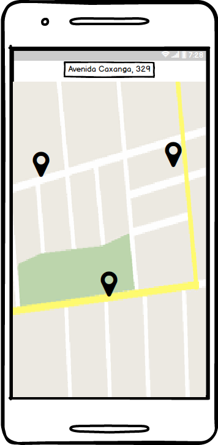

# 1.Ideia
A ideia do aplicativo é disponibilizar uma plataforma onde o usuário pode fazer reservas de restaurantes não apenas pelas reviews e menus, mas também escolher a mesa (como se fosse uma reserva de uma cadeira de cinema). Dessa forma será mais conveninente ir a um restaurante sabendo onde irá sentar sem se preocupar em não ter mesas e fazer reservas com antecedência.

# 2. Quem usará e por quê?
O aplicativo é voltado para o público em geral que deseja ir a algum restaurante. Os mesmos poderão ver reviews do local, o cardápio, e as mesas disponíveis em um certo horário. A vantagem de uso é poder organizar melhor a ida a um restaurante sem enfrentar filas, correr o risco do mesmo estar lotado ou não ter mais mesas disponíveis no dia e até escolher uma mesa específica perto de janelas, por exemplo.

# 3. Aplicativos Similares
Existem aplicativos similares, porém não com a ideia de mapa interno e os mais bem votados dessa categoria não possuem cobertura no Brasil
* OpenTable
* thefork

# 4. Mockup de Telas
    